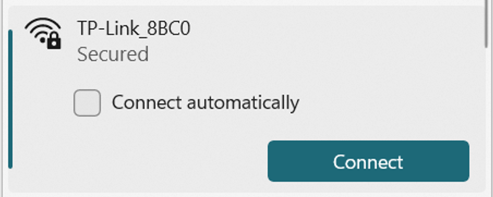
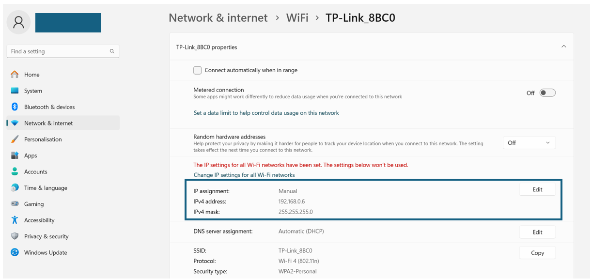

# TaskAssistanceFramework

## Task Assistance Environment

A simulation modeling two of the lab robots (one URe3 and one URe5).

Files:

<details>
  <summary style="color:lightskyblue; font-size: 1.4em;">simulation</summary>
       Contains all files related to the simulation of the robots.

  <details>
  <summary style="color:lightblue;">building_blocks.py</summary>
   Contains all the basic functions that are used in the simulation such as local planning and collision checking.
  </details>

  <details>
    <summary style="color:lightblue;">environment.py</summary>
      Contains the environment that is used to model the obstacles.
  </details>
  
  <details>
    <summary style="color:lightblue;">intervals_runner.py</summary>
       Implements path discretization, interval normalization, and visibility interval etc.
  </details>
  
  <details>
    <summary style="color:lightblue;">inverse_kinematics.py</summary>
        Contains the inverse kinematics functions and specifics for the URe robots.
  </details>
  
  <details>
    <summary style="color:lightblue;">kinematics.py</summary>
    Contains the kinematics of the robot such as DH (denavit hartenberg) and geometric parameters.
  </details>
  
  <details>
    <summary style="color:lightblue;">RRG.py</summary>
      Contains the RRG algorithm.
  </details>
  
  <details>
    <summary style="color:lightblue;">run.py</summary>
      Runs the RRG algorithm on the simulated environment.
  </details>
  
  <details>
    <summary style="color:lightblue;">visualizer.py</summary>
    Presents real-time visualization and plotting of the environment in 3D using Matplotlib.
  </details>

<br/>
</details>


<details>
  <summary style="color:lightskyblue; font-size: 1.4em;">URManipulators</summary>
    Contains all files related to the real robots and camera control.
<details>
  <summary style="color:lightblue;">CameraController.py</summary>
  Contains the code that controls the camera mounted on the URe5.
</details>

<details>
  <summary style="color:lightblue;">execute_final_path.py</summary>
  Contains the execution of both the task and assistance robot.
</details>

<details>
  <summary style="color:lightblue;">generate_intervals.py</summary>
     Compute the intervals in which the gripper is visible from the camera feed while the task robot is executing its task.
</details>

<details>
  <summary style="color:lightblue;">generate_samples.py</summary>
   Generate samples for the RRG algorithm.
</details>

<details>
  <summary style="color:lightblue;">Robots.py</summary>
   Contains the basic classes used to control the robots.
</details>

</details>

## **Real Robots Connection Instructions**


### step 1 - connect to the TP-Link_8BC0 router
The first option is to connect via wifi.

wifi password: 65729922



The second option is to connect directly to the router throughout an ethernet cable.

The router has no DHCP so the IP address needs to be configured manually 



the IP adress should be in the range 192.168.0.20-192.168.0.30 and the mask should be 255.255.0.0.

Important IP addresses:

- URe5: 192.168.0.10
- URe3: 192.168.0.11
- Camera: 192.168.0.3

### Code Example

```jsx
from Robots import TaskRobot, AssistanceRobot

assistance_robot = AssistanceRobot()
task_robot = TaskRobot()

if __name__ == '__main__':
    # all joint angles are in rad
    home_conf = [0, -1.57, 0, -1.57, 0, 0]

    # move robots
    assistance_robot.move(home_conf)
    task_robot.execute_task()
```


